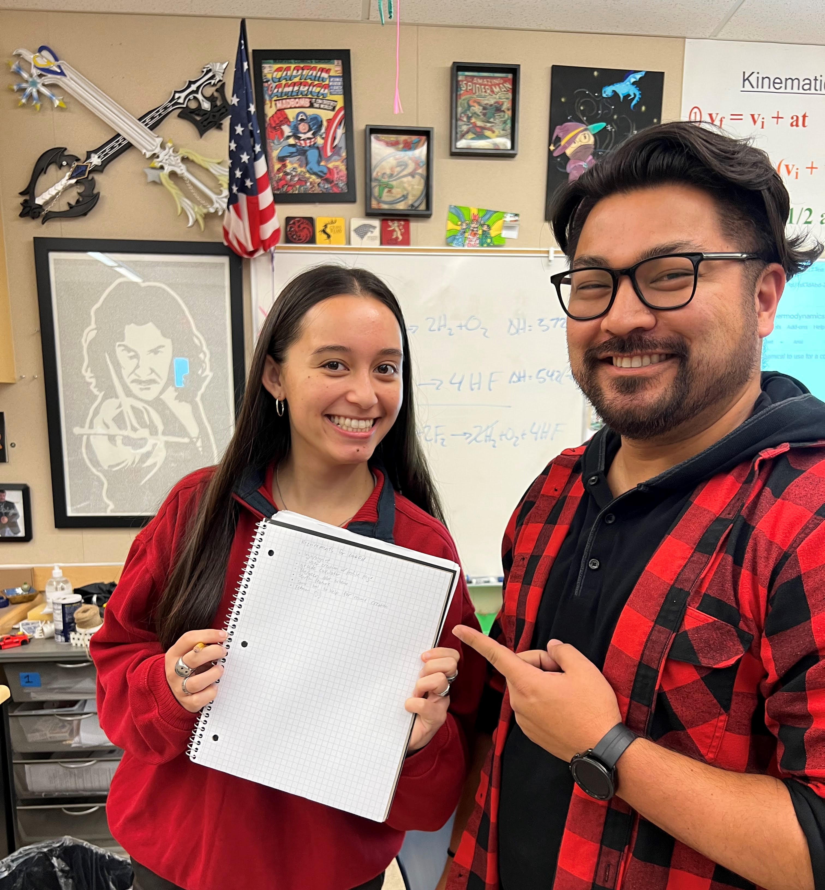



# [Masterplan](https://github.com/avabrooks/swagketo/issues/14):

## Requirements from Sponsor(Mr. Eckman)
* login/signup page
  * user creation w/ profile page
* grade calculator
* blue/green color scheme
* search feature
* some tool to help with resume creation
* Eckman easter egg
 ** Insert Photos Here from Sponsor Meeting**

## Implementing Mortensen Feedback:
 * Grade Calculator:
   * comments: Make a requirement tracker (similar to STUDENTVUE) which can incorporate parts of privacy and security
   * Can make two separate pages and add lots of graphics with bars for percentages??
 * Resume creator:
   * Comments: Similar to Linkedn, but make it more specific to high school students
   * Can potentially use polymorphism
   * Can possibly automate with the profile by transfering info from profile to resume (need to save info to profiles)

## Objectives for Last 13 Days:
 * Finish website with functionality
 * First two days will be for the actual creation of the website page
 * Five days will be dedicated to back end
 * Four days will be dedicated to front end
 * Two days will be dedicated to clean up and presentation

## Individual Assignments: 
 * [Ava](https://github.com/avabrooks/swagketo/issues/16): Design layouts with colorscheme(SCSS) 
 * [Crystal](https://github.com/avabrooks/swagketo/issues/17): Resume creator/tool 
 * [Sarah](https://github.com/avabrooks/swagketo/issues/15): Database work with different 'roles' in database for student vs admin 
 * [Risa](https://github.com/avabrooks/swagketo/issues/18): Grade calculator

