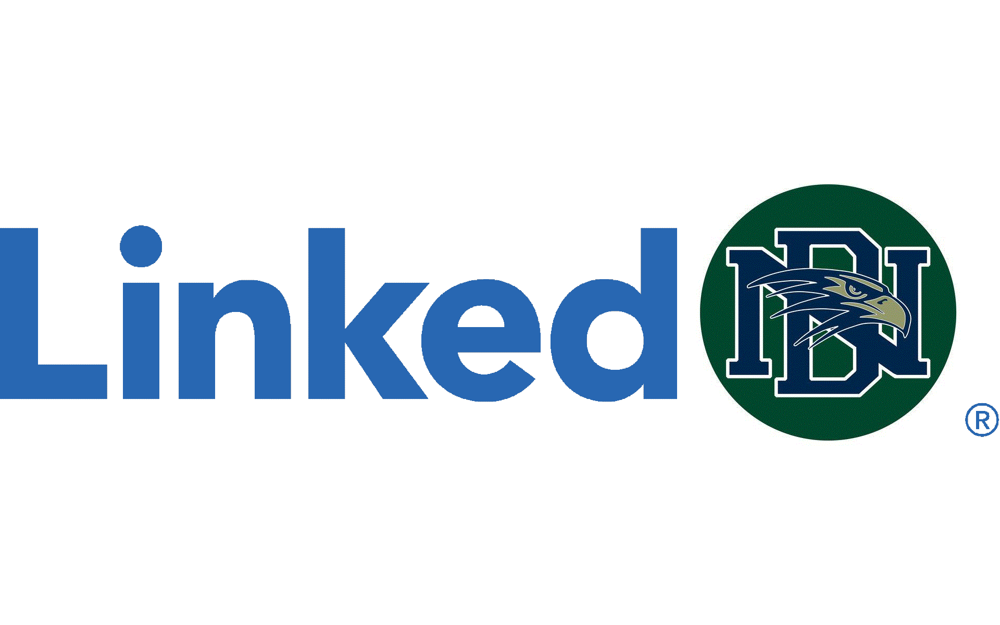

Project Description, Ideas, Wires, Success idea

# Project Ideas
* [**Linkedin**](https://www.linkedin.com/) 
    - Platform for students: PUSD linkedin, sort by classes, 
    - Rogerhub, grade generator  
    - More DN specific = can contact principal 
    - Sponsored by PUSD!
* Squirrel website
    - Can upload pictures of squirrels 
    - Theme song: Squirrel's in my pants - Phineas & Ferb
    - Sponsor = Boys & Girls club 
* Girl Scouts
    - Buying cookies & reselling cookies to foreign countries
    - Uploading ideas for projects 
    - Sponsor = Vivian 
* Second Serve Revamp
    - Network, social media 
    - System for Amani to be able to contact the head, advisors, etc. 
    - Sponsor = Amani 

# Success Ideas 
* [Linkedin](https://www.linkedin.com/) 
    - Platform for students: PUSD linkedin, sort by classes, 
    - Rogerhub, grade generator  
    - More DN specific = can contact principal 
    - Sponsored by DNHS 

# Project Description 
* LinkDN
    - This is a networking platform where students of Del Norte High School can make profiles that allow students to connect and find common interests through similar career pathways. 
    - Services:
         - Profile creation with customizable features(bio, profile picture, classes taken, etc.)
         - Grade calculator
         - Search for other students in the school
         - See other club activities for school wide events 
         - Connect with other students for various academic endeavours 
         - Chat with students
         - Admin can make school-wide posts
         - Class schedule connecter 

# Wiring

## Templates:
 * index.html
 * layout.html
    - implement elements of SCSS
 * fragments(directory)
    - nav
    - footer
    - body

## Design Plan: 
* Color Scheme: 
      * Primary navy blue: #000080

 * Secondary: #006400

      * used as accents across website
* font: Poppins, sans-serif
* Use Bootstrap for nav bar and templating for most efficient use of sassy

### Covering SASS
 * Resources:
   * [Bootstrap](https://getbootstrap.com/docs/5.0/getting-started/introduction/#starter-template)
   * [Customizing SASS](https://getbootstrap.com/docs/5.0/customize/sass/)

## Technical Ideas/Plans
- Profile creation with customizable features(bio, profile picture, classes taken, etc.)
    - sqlite.db
    - Use MVC for profile signup/login; similar to old project [here]()
    - db setup similar to [this]()
- Grade calculator
- Search for other students in the school
- See other club activities for school wide events 
- Connect with other students for various academic endeavours 
- Chat with students
- Admin can make school-wide posts
- Class schedule connecter 

